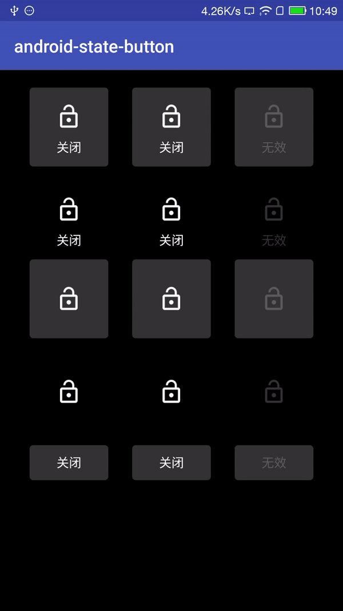

# android-state-button

[](https://jitpack.io/#mazouri/android-state-button)

# About
android-state-button is a custom view for mutil state button. 

# Demo



# How to use?

1.Add it in your root build.gradle at the end of repositories:
```
	allprojects {
		repositories {
			...
			maven { url 'https://jitpack.io' }
		}
	}
```
 2.Add the dependency
```
	dependencies {
	        compile 'com.github.mazouri:android-state-button:1.0'
	}
```

```
        <mazouri.statebutton.StateButton
            android:id="@+id/state_button"
            android:layout_width="90dp"
            android:layout_height="90dp"
            app:enabledBackground="@drawable/state_button_bg_enable"
            app:enabledText="关闭"
            app:enabledIcon="@drawable/ic_lock_open"
            app:enabledTextColor="#ffffff"
            app:disabledBackground="@drawable/state_button_bg_disable"
            app:disabledText="无效"
            app:disabledIcon="@drawable/ic_lock_disable"
            app:disabledTextColor="#33ffffff"
            app:selectedBackground="@drawable/state_button_bg_selected"
            app:selectedText="打开"
            app:selectedIcon="@drawable/ic_lock"
            app:selectedTextColor="#ffffff"
            app:drawablePadding="10dp"
            app:iconTopMargin="18dp"
            app:iconWidth="30dp"
            app:iconHeight="30dp"
            app:state="enabled"/>
```

<table>
    <tr>
        <th>enabledBackground</th>
        <th>正常状态的背景</th>
    </tr>
    <tr>
        <th>enabledText</th>
        <th>正常状态的文字</th>
    </tr>
    <tr>
        <th>enabledIcon</th>
        <th>正常状态的图标</th>
    </tr>
    <tr>
        <th>enabledTextColor</th>
        <th>正常状态的文字颜色</th>
    </tr>
</table>
<table>
    <tr>
        <th>disabledBackground</th>
        <th>disabled状态的背景</th>
    </tr>
    <tr>
        <th>disabledText</th>
        <th>disabled状态的文字</th>
    </tr>
    <tr>
        <th>disabledIcon</th>
        <th>disabled状态的图标</th>
    </tr>
    <tr>
        <th>disabledTextColor</th>
        <th>disabled状态的文字颜色</th>
    </tr>
</table>
<table>
    <tr>
        <th>selectedBackground</th>
        <th>选择状态的背景</th>
    </tr>
    <tr>
        <th>selectedText</th>
        <th>选择状态的文字</th>
    </tr>
    <tr>
        <th>selectedIcon</th>
        <th>选择状态的图标</th>
    </tr>
    <tr>
        <th>selectedTextColor</th>
        <th>选择状态的文字颜色</th>
    </tr>
</table>

<table>
    <tr>
        <th>drawablePadding</th>
        <th>图标与文字间距</th>
    </tr>
    <tr>
        <th>iconTopMargin</th>
        <th>图标上方间距</th>
    </tr>
    <tr>
        <th>iconWidth</th>
        <th>图标宽度</th>
    </tr>
    <tr>
        <th>iconHeight</th>
        <th>图标高度</th>
    </tr>
     <tr>
        <th>state</th>
        <th>StateButton默认状态</th>
    </tr>
</table>

You can also fork this project to update your own states
